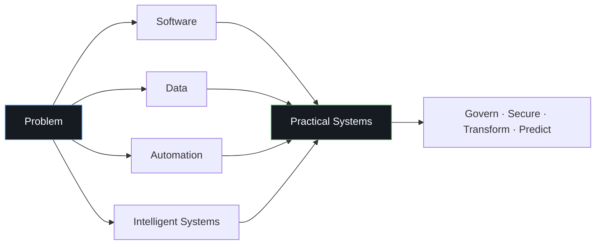
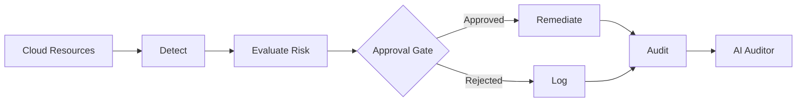
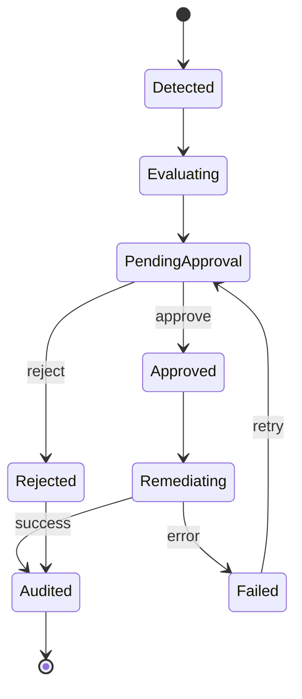
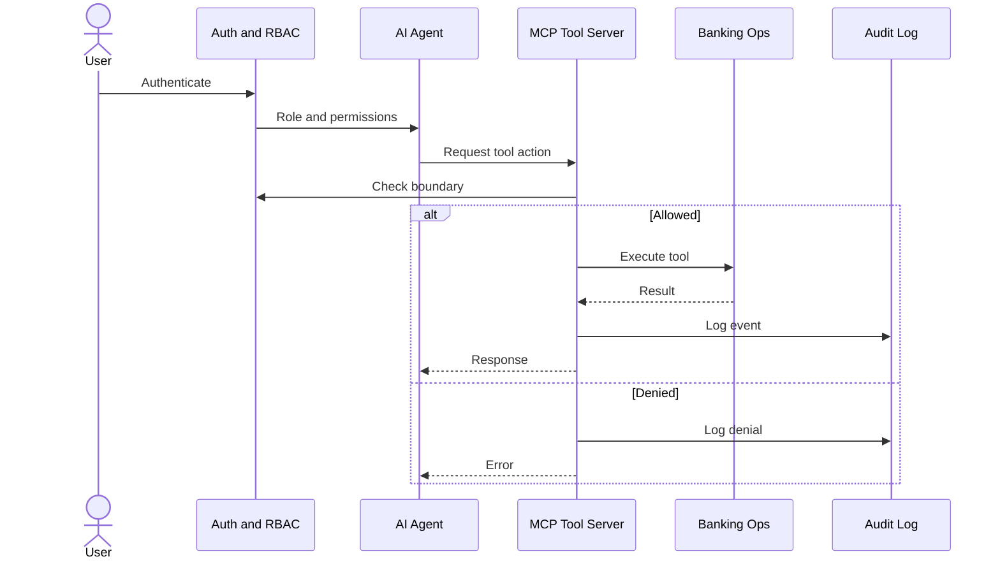
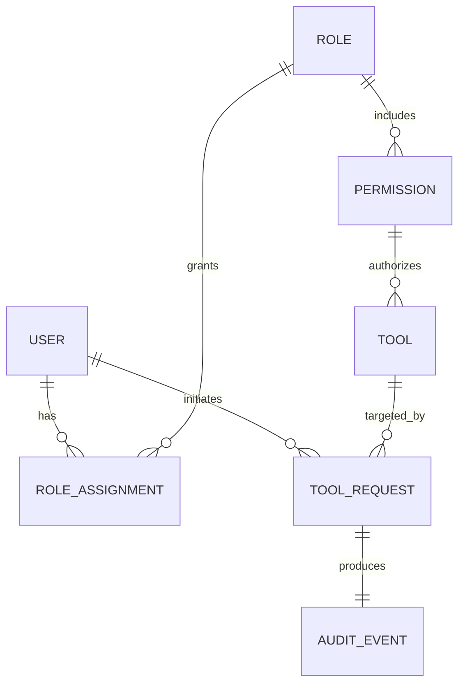
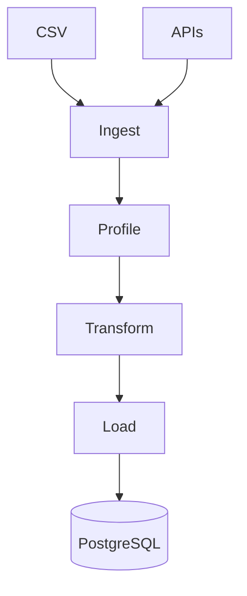
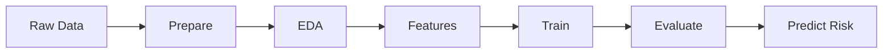
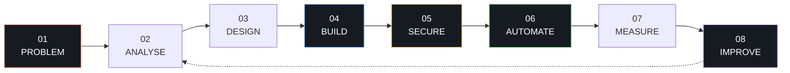

<!-- =========================================================
     HERO
========================================================= -->

 

 

  <em>
    Bachelor of Information Technology student building practical systems
    that turn problems into software, data, automation, and intelligent workflows.
  </em>

 

  
  
  
  

 

&nbsp;

  

&nbsp;

&nbsp;

 

---

<!-- =========================================================
     WHAT I BUILD
========================================================= -->

<h2 id="what-i-build">What I Build</h2>

<table>
<tr>
<td width="25%" align="center">

 <strong>Software</strong> 
APIs, auth, architecture
</td>
<td width="25%" align="center">

 <strong>Data</strong> 
Pipelines, analytics, ML
</td>
<td width="25%" align="center">

 <strong>Automation</strong> 
Workflows and orchestration
</td>
<td width="25%" align="center">

 <strong>Intelligent Systems</strong> 
MCP, agents, controlled tools
</td>
</tr>
</table>

<strong>How my work connects</strong>

 

Across my projects: <strong>understand → design → automate → keep it safe and measurable.</strong>

 

---

<!-- =========================================================
     FEATURED PROJECTS
========================================================= -->

<h2 id="featured-projects">Featured Projects</h2>

### CloudGuard

<strong>Cloud Governance · Automation · Intelligent Systems</strong>

A local-first cloud governance platform built around
<strong>detection, controlled remediation, human approval and auditability.</strong>

&nbsp;

<strong>Details</strong>

 

<strong>Highlights:</strong> policy detection · remediation workflows · MCP-style tools · human approval gates · audit trails · AI auditor

 

---

### BankOps AI MCP Server

<strong>Secure Operations · RBAC · Automation</strong>

AI-assisted banking ops prototype with
<strong>permissions, controlled tool access and auditability.</strong>

&nbsp;

<strong>Details</strong>

 

<strong>Highlights:</strong> RBAC · controlled tools · authz · workflow orchestration · audit logging

 

---

### Distributed ETL Orchestrator

<strong>Data Engineering · ETL · Cloud</strong>

Distributed pipeline for automated ingestion, profiling, transformation and loading.

&nbsp;

<strong>Details</strong>

 

<strong>Highlights:</strong> CSV profiling · SQL DDL · API ingest · orchestration · Postgres/Supabase · Docker · AWS ECS/Fargate

 

---

### Academic Risk Prediction

<strong>Machine Learning · Analytics · Decision Support</strong>

ML project using student data to identify academic risk patterns and support earlier intervention.

&nbsp;

<strong>Details</strong>

 

<strong>Highlights:</strong> data prep · EDA · feature engineering · classification · evaluation · reproducible experiments

 

---

<!-- =========================================================
     TECHNOLOGY
========================================================= -->

<h2 id="technology">Technologies and Tools</h2>

### Languages

### Development

### Databases

### Cloud and DevOps

### Data and ML

&nbsp;

&nbsp;

&nbsp;

&nbsp;

&nbsp;

---

<!-- =========================================================
     ENGINEERING APPROACH
========================================================= -->

<h2 id="engineering-approach">Engineering Approach</h2>

I don't start with a framework. I start with the problem, then design a system that can be
<strong>built, secured, automated and improved</strong> over time.

 

 

<table>
<tr>
<td width="25%" valign="top">

<strong>01 · Problem</strong>
 
What are we solving, and for whom?

</td>
<td width="25%" valign="top">

<strong>02 · Analyse</strong>
 
Where should responsibility live? What can fail?

</td>
<td width="25%" valign="top">

<strong>03 · Design</strong>
 
Data flow, boundaries, roles, and interfaces.

</td>
<td width="25%" valign="top">

<strong>04 · Build</strong>
 
Ship a working slice, not a perfect abstraction.

</td>
</tr>
<tr>
<td width="25%" valign="top">

<strong>05 · Secure</strong>
 
Auth, RBAC, and audit trails by default.

</td>
<td width="25%" valign="top">

<strong>06 · Automate</strong>
 
Turn repeatable work into workflows.

</td>
<td width="25%" valign="top">

<strong>07 · Measure</strong>
 
Logs, metrics, and outcomes that prove value.

</td>
<td width="25%" valign="top">

<strong>08 · Improve</strong>
 
Feed results back into the next iteration.

</td>
</tr>
</table>

 

<strong>How this shows up in my systems</strong>

 

<table>
<tr>
<td width="33%" valign="top">

<strong>Security</strong>
  
Permissions and auditability are part of the design, not a later patch.
  
<code>Authenticate → Authorize → Execute → Audit</code>

</td>
<td width="33%" valign="top">

<strong>Data</strong>
  
I care about the full path from raw input to a usable decision.
  
<code>Collect → Clean → Transform → Act</code>

</td>
<td width="34%" valign="top">

<strong>Intelligent systems</strong>
  
Agents only act through controlled tools with clear boundaries.
  
<code>Agent → Policy → Tool → State → Log</code>

</td>
</tr>
</table>

 

---

<!-- =========================================================
     PROFILE FOOTER
========================================================= -->

### Build things. Understand the system. Improve it.

 

&nbsp;

&nbsp;

  

Bachelor of Information Technology · Software Engineering · Data · Automation · Intelligent Systems

  

### Building · Securing · Shipping

